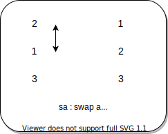

<div align="center" max-width="300px">
	
</div>

# 🔢 push_swap

## Summary

This project will make you sort data on a stack, with a limited set of instructions, using the lowest possible number of actions. 

To succeed you’ll have to manipulate various types of algorithms and choose the most appropriate solution (out of many) for an optimized data sorting.

## Requirements

<code>push_swap</code> program should sort the integers received as arguments using the lowest possible number of instruction and display these instruction on the standart output.

## Rules

• You have 2 stacks named a and b.

• At the beginning:

&nbsp;&nbsp;&nbsp;&nbsp;&nbsp;&nbsp;◦ The stack a contains a random amount of negative and/or positive numbers which cannot be duplicated.

&nbsp;&nbsp;&nbsp;&nbsp;&nbsp;&nbsp;◦ The stack b is empty.

• The goal is to sort in ascending order numbers into stack a. To do so you have the

<b>🔁 Allowed operations 🔁</b>:

<code>sa (swap a)</code>: Swap the first 2 elements at the top of stack a. Do nothing if there is only one or no elements.

<code>sb (swap b)</code>: Swap the first 2 elements at the top of stack b.
Do nothing if there is only one or no elements.

<code>ss</code> : sa and sb at the same time.

<div align="center" style="max-width: 300px; margin: 0 auto">
	
</div>

<!-- |             |             |
| :---        | :---        |
| 2           | 1           |
| 1           | 2           |
| 3           | 3           |
| **stack a** | **stack a** | -->

<code>pa (push a)</code>: Take the first element at the top of b and put it at the top of a. Do nothing if b is empty.

<div align="center" style="max-width: 300px; margin: 0 auto">
	
</div>

<code>pb (push b)</code>: Take the first element at the top of a and put it at the top of b. Do nothing if a is empty.

<code>ra (rotate a)</code>: Shift up all elements of stack a by 1.
The first element becomes the last one.

<div align="center" style="max-width: 300px; margin: 0 auto">
	
</div>

<code>rb (rotate b)</code>: Shift up all elements of stack b by 1.
The first element becomes the last one.

<code>rr</code>: ra and rb at the same time.
rra (reverse rotate a): Shift down all elements of stack a by 1. The last element becomes the first one.

<code>rra (reverse rotate a)</code>: Shift down all elements of stack a by 1. The last element becomes the first one.

<div align="center" style="max-width: 300px; margin: 0 auto">
	
</div>

<code>rrb (reverse rotate b)</code>: Shift down all elements of stack b by 1. The last element becomes the first one.

<code>rrr</code>: rra and rrb at the same time.

## Realization

### Three elements

To sort three elements I hard coded saveral cases.

For example:

<b>Case 1</b>

|     |     |     |      |     |
| --- | --- | --- | ---  | --- |
| 1   |     | 5   |      | 1   |
| 5   | sa  | 1   | ra ↑ | 3   |
| 3   |     | 3   |      | 5   |

<b>Case 2</b>

|     |     |     |
| --- | --- | --- |
| 3   |     | 1   |
| 1   | sa  | 3   |
| 5   |     | 5   |

<b>Case 3</b>

|     |       |     |
| --- | ---   | --- |
| 3   |       | 1   |
| 5   | rra ↓ | 3   |
| 1   |       | 5   |

<b>Case 4</b>

|     |       |     |     |     |
| --- | ---   | --- | --- | --- |
| 5   |       | 3   |     | 1   |
| 3   | ra ↑  | 1   | sa  | 3   |
| 1   |       | 5   |     | 5   |

<b>Case 5</b>

|     |      |     |
| --- | ---  | --- |
| 5   |      | 1   |
| 1   | ra ↑ | 3   |
| 3   |      | 5   |

### n > 3 && n < 10

For more than three elements and less than ten I used this algorithm -> 

[Fastest Push_Swap Algorithm](https://zainab-dnaya.medium.com/fastest-push-swap-algorithm-2f510028602b)

### n > 10

For number of elements ***more than 10*** I used algo where we should count the number of moves for every element in stack b and choose the "cheapest" element to push to spack a.

It is really helpfull to try this algo in Google Docs to visualize its realization.

***School21 algo explanations***

[School21 project](https://www.youtube.com/watch?v=xp4DUxGUggU)

[edu_events_moscow](https://www.youtube.com/watch?v=KeDXVukgd9g)

## Bonus

For bonus part we need to make <code>checker</code> program that should test whether <code>push_swap</code> sort stack properly.

## Run

<code>make</code> or <code>make all</code> will compile both push_swap and checker programs

```
./push_swap [list of arguments]
```
```
ARG="[list of arguments]"; ./push_swap $ARG | ./checker $ARG
```

### Useful commands to test the program

```
ARG=`ruby -e "puts (1..500).to_a.shuffle.join(' ')"`; ./push_swap $ARG | ./checker $ARG
```

```
ARG="-755254759 46382822 168313279 -712408378 -976005565 532734670 -658929270"; ./push_swap $ARG
```
